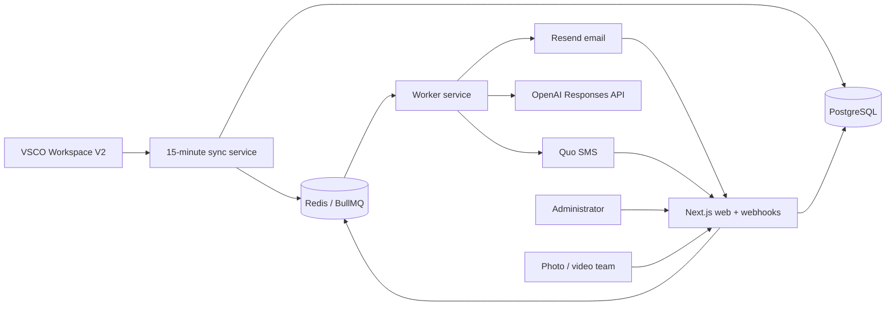

# Authentic Moments Booking and Reminder Agent

A production-oriented scheduling operations system for Authentic Moments Media. It synchronizes weddings from VSCO Workspace, keeps confirmations and communication history in PostgreSQL, plans durable reminders through BullMQ/Redis, sends through Resend and Quo, handles replies, and gives administrators and project managers a daily-operations dashboard.

Test mode is on by default. Real contractors are never contacted until `TEST_MODE=false` is explicitly configured.

## Architecture



The external provider abstraction normalizes VSCO data without allowing VSCO to overwrite confirmation state, local pauses, notes, or administrator decisions. Raw provider payloads and every synchronization run are retained.

## Local development

Requirements: Node 22+, PostgreSQL, and Redis.

```bash
cp .env.example .env
npm install
npm run db:migrate
npm run db:seed
npm run dev
```

Run the worker separately with `npm run worker`. Run one reconciliation cycle with `npm run sync`. Set `DEMO_SEED=true npm run db:seed` for demonstration records. There is no fallback or automatically seeded administrator login. Production administrator provisioning is a controlled one-time operation, and runtime authentication recognizes only the approved administrator identity and role.

Set `AUTH_SECRET` to at least 32 random characters before deployment.

## Environment variables

See [.env.example](.env.example). Provider credentials are server-only. Important safety settings:

- `TEST_MODE=true` redirects mail and text to `TEST_EMAIL_RECIPIENT` and `TEST_SMS_RECIPIENT`, visibly marking the original destination.
- `GLOBAL_COMMUNICATIONS_PAUSED=true` suppresses all automated sending.
- `EMAIL_REPLY_DOMAIN` should be a dedicated receiving subdomain.
- `QUO_PHONE_NUMBER` and `QUO_PHONE_NUMBER_ID` select the existing sender; no number is hardcoded.
- `PROJECT_MANAGER_NAME`, `PROJECT_MANAGER_EMAIL`, `PROJECT_MANAGER_PHONE`, `PROJECT_MANAGER_PASSWORD` (or `_B64`), `PROJECT_MANAGER_DAILY_BRIEF_ENABLED`, and `PROJECT_MANAGER_DAILY_BRIEF_TIME` can create Cylina during a seed. Leaving contact fields blank is safe; an owner/admin can invite or update the project manager from Settings.
- `VSCO_TASK_WEBHOOK_SECRET` protects the VSCO task-event fallback. It must be at least 24 random characters and is never displayed in the dashboard.
- `SYSTEM_DEV_EMAIL` receives deduplicated production issue alerts for exhausted communication jobs, webhook-processing failures, failed/bounced delivery events, and repeated VSCO synchronization failures.

## Project-manager operations

`/operations` is the project-manager workspace. It groups upcoming events into Ready, Waiting, At risk, Incomplete, and Changed since confirmation; explains every readiness blocker; shows alerts, recent VSCO changes, planned actions, responses, and local/VSCO milestones; and provides audited controls for contractor contact, reminder resends, contact corrections, manual assignments, status changes, replacements, notes, pauses, and alert resolution.

Required staffing is configured by event/job type in Settings. An event is ready only when required roles are filled, active assignments are confirmed, required venue details are present, material post-confirmation changes are resolved, and no critical task or other blocker remains.

Project managers have operational access but cannot view raw secrets, modify authentication/security controls, delete audit history or records, or enable production communication. Consequential changes use explicit controls, permission checks, audit records, and idempotency keys.

The sync cycle recalculates readiness and sends deduplicated alerts for new blockers and readiness transitions. Each configured project manager can choose email, SMS, or both for alerts and set a daily brief time. The daily email emphasizes the next 7 days while summarizing the next 30 days, recent readiness, declines/conflicts, failed delivery, upcoming reminders, overdue critical tasks, and recommended actions.

### Controlled production launch

Settings includes an owner-only, idempotent production-launch preparation control. Preparation must run while `TEST_MODE=true` and does not contact anyone. It:

- creates one introduction text per active, unpaused, SMS-eligible contractor profile with a valid phone number;
- excludes inactive, removed, paused, opted-out, and missing-phone profiles;
- suppresses reminder assignments whose events are less than seven exact days away at launch;
- preserves the normal sequential reminder program for later events;
- schedules introductions before reminders and removes stale queued jobs.

After the plan is prepared, change Railway `TEST_MODE=false` and redeploy. Contractor delivery remains blocked at the message layer until a scheduled reconciliation changes the prepared launch state to `LIVE`. The system then queues the introduction campaign, starts eligible reminder sequences, retains STOP/START compliance, records provider delivery events, and emails the configured system developer when an operational failure exhausts retries.

## VSCO Workspace

Create a dedicated **Read Only** key under Workspace Settings → API Integrations. The confirmed current API base is `https://workspace.vsco.co/api/v2/`.

VSCO publicly states that not all Workspace data is available in its first public API release. The public documentation does not expose a stable, unauthenticated list of event/team-assignment paths. Therefore this application does not invent one: set `VSCO_EVENTS_PATH` to the precise events endpoint shown by the authenticated API documentation for the account. The normalizer expects the documented event representation to be mapped at the provider boundary. If an API response omits `assignments`, the sync is marked with a warning, the dashboard does not claim completeness, and administrators can retain manual assignments.

The sync supports cursor pagination, exponential retry for 429/5xx responses, historical/future windows, raw payload storage, event cancellation, assignment addition/removal, stale-reminder cancellation, and idempotent upserts.

For this application, a booked gig is a VSCO ceremony whose job has an assigned photographer or videographer. Lead calendar items and ceremonies without a production assignment are skipped. Older duplicate ceremony rows sharing the same VSCO job are automatically archived, along with their pending reminders.

Reminder actions are sequential. Each unconfirmed assignment has at most one active reminder action. A later escalation is planned only after the current step is successfully sent (or an administrator explicitly skips it) and the assignment is still unconfirmed. Confirmation cancels the remaining sequence.

### VSCO task capability and automation fallback

Settings records the result of task capability inspection. The current published Workspace V2 documentation does not document a complete task-list API contract, so the application does not guess an endpoint or response fields. Direct task list, assignment, due-date, completion, deletion, and assigned-user reads remain marked unsupported unless a verified authenticated API contract is implemented.

VSCO does officially document the `Task › Completed` automation observable and the `Web Request` action. To report completed tasks:

1. Set a random `VSCO_TASK_WEBHOOK_SECRET` on the web service.
2. In VSCO Workspace, create an automation with observable **Task › Completed**.
3. Optionally add a condition matching `{{item.name}}`.
4. Add a **Web Request** action using `POST`.
5. Set the destination to:

   `https://YOUR_DOMAIN/api/webhooks/vsco/task-event?secret=YOUR_SECRET`

6. Send JSON using only tokens verified in VSCO’s automation documentation:

```json
{
  "providerEventId": "task-{{job.id}}-{{item.name}}",
  "eventType": "task.completed",
  "jobId": "{{job.id}}",
  "jobName": "{{job.type}}",
  "taskName": "{{item.name}}"
}
```

The endpoint also accepts authenticated `job.stage_changed` and `milestone.reached` events when an automation supplies their values. Every payload is stored idempotently, updates a locally sourced operational milestone, creates an audit record, and recalculates linked-event readiness.

**A task-completion webhook confirms that a specific task was completed. It does not automatically provide the full list of all open or overdue VSCO tasks.**

Until a complete task API is available, Settings and Operations allow smaller critical milestones to be tracked locally. Each record visibly identifies its source as VSCO API, VSCO automation webhook, AMM Robot calculated status, or manual project-manager entry; these milestones never claim to be the entire VSCO task list.

Official references: [VSCO public API](https://help.workspace.vsco.co/en/articles/13259288-public-api), [Task Completed](https://help.workspace.vsco.co/en/articles/13259668-task-completed), [Web Request action](https://help.workspace.vsco.co/en/articles/13259697-web-request-action), and [Tasks menu behavior](https://help.workspace.vsco.co/en/articles/13259220-tasks-menu).

## Resend setup

1. Verify the sending domain and set `EMAIL_FROM`.
2. Create a dedicated receiving subdomain, add its MX records, and set `EMAIL_REPLY_DOMAIN`.
3. Register `https://YOUR_DOMAIN/api/webhooks/resend` for `email.received`, delivery, bounce, failure, and complaint events.
4. Set `RESEND_API_KEY` and the `whsec_...` value as `RESEND_WEBHOOK_SECRET`.

The handler verifies the unmodified body with Resend/Svix headers and stores provider event IDs idempotently before queuing work. Resend receiving webhooks contain metadata; the worker should retrieve full received-email content through Resend’s Receiving API.

## Quo setup

Create an API key and webhook signing key in Quo (formerly OpenPhone). Configure inbound message and delivery events at `https://YOUR_DOMAIN/api/webhooks/quo`, then set `QUO_API_KEY`, `QUO_PHONE_NUMBER`, `QUO_PHONE_NUMBER_ID`, and `QUO_WEBHOOK_SIGNING_KEY`. Signature verification uses the unmodified request body. Confirm the signature header and encoding against the version of Quo’s webhook documentation enabled for the account before production activation.

STOP, START, HELP, CONFIRM, DECLINE, SCHEDULE, DETAILS, LOCATION, HOURS, and PAY are processed deterministically before any model call. The first reminder text includes the help menu once per contractor. PAY exposes only the fixed standard rate card and mileage formula; individual payouts, invoices, client pricing, billing, taxes, and contract amounts remain blocked before database or model lookup. Scheduling tools expose only the identified contractor's whitelisted ceremony fields. E.164 identities are never merged by similar name.

## OpenAI

Set `OPENAI_API_KEY` and `OPENAI_MODEL`. The scheduling agent uses the Responses API with function tools and `store: false`. Database tools restrict schedule access to the identified sender; coworker information is only eligible for a shared event. Model inputs, outputs, and tool calls are recorded with secret redaction.

## Railway deployment

Create one Railway project with PostgreSQL and Redis, then three services from this repository:

| Service | Start command | Purpose |
|---|---|---|
| `amm-web` | `npm run db:migrate && npm run start` | Next.js UI, confirmation flow, API, webhooks, health |
| `amm-worker` | `npm run worker` | BullMQ delivery and inbound processing |
| `amm-sync` | `npm run sync` | Scheduled reconciliation; exits after one run |

Set the sync service cron to `*/15 * * * *`. Add Railway’s `DATABASE_URL` and `REDIS_URL` references to all three services. Use `/api/health` for the web health check. Run `npm run db:seed` once as a Railway command after the first migration.

The Dockerfile supports all three process commands. Do not run more than one migration process during a schema rollout.

## Production activation checklist

1. Configure PostgreSQL backups and test a restore into a separate database.
2. Populate every environment variable; keep `TEST_MODE=true`.
3. Run migrations and seed policies/admin.
4. Confirm VSCO’s authenticated endpoint and inspect a sync warning/details record.
5. Configure Resend receiving MX and webhook DNS.
6. Configure Quo sender and signed webhook.
7. Send redirected test email/SMS and complete a link confirmation.
8. Verify webhook delivery, opt-out, ambiguity, and bounce behavior.
9. Change `TEST_MODE=false` only after administrator review.

Emergency stop: set `GLOBAL_COMMUNICATIONS_PAUSED=true` on worker/web/sync and redeploy. Existing queued work remains auditable and will be suppressed when processed.

## Testing and operations

```bash
npm run typecheck
npm run lint
npm test
npm run build
npm run test:e2e
```

The Logs screen stores sync runs, webhook events, agent runs, and audit history independently of Railway logs. BullMQ retries use exponential backoff; exhausted jobs remain visible as failed jobs in Redis and related action errors are retained in PostgreSQL.

For backup, use Railway PostgreSQL backups or `pg_dump "$DATABASE_URL" > backup.dump`. Restore only to a verified empty target with `pg_restore`. Redis is queue state, not the authoritative history; PostgreSQL must be backed up.

## Data ownership and known limitations

- VSCO: events, times, venues, external assignments when the API exposes them.
- PostgreSQL: confirmations, reminders, messages, planned/completed actions, overrides, notes, settings, and audit history.
- A missing VSCO assignment collection is explicitly reported; it is never interpreted as a complete empty assignment list.
- Provider credentials, DNS, an account-specific authenticated VSCO endpoint, and live webhook signature samples cannot be completed without the owner’s accounts.
